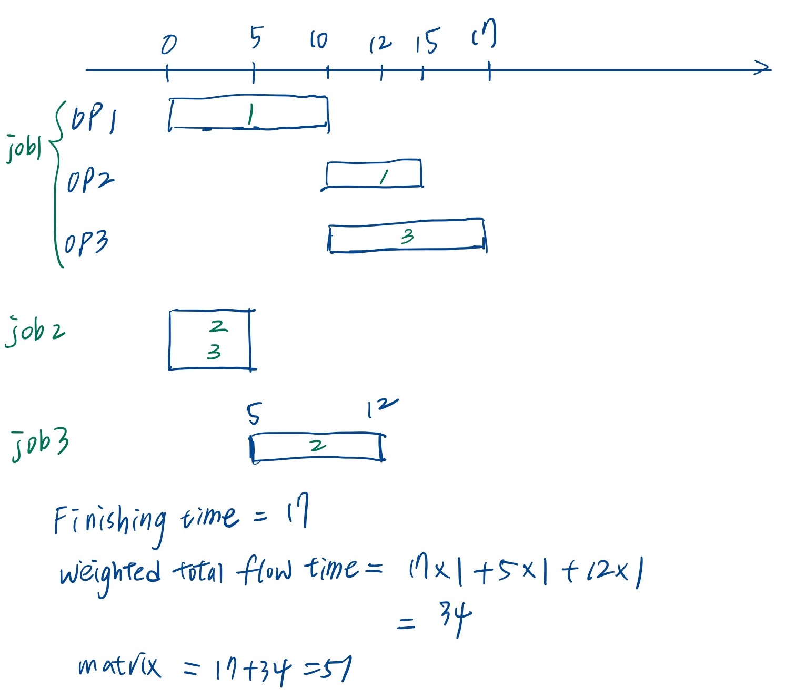

# ADA Final Challenge 2020 #

For the assignment specifications, please refer to <https://hackmd.io/6zxbedYCSLe8M8hW1Su0ww>.

### Login
- Account: Team18@ada-judge.csie.ntu.edu.tw
- Password: 0JnKWWxz5n


### I/O
*  job/ operation/slices 的 idx 從 1 開始，時間從 0 開始

* input:  
```
3            // 同時間可用的資源數量 (slices)
3            // 需要 process 的 job 數

// === 第一個 job ==== 
3            // 所需的 operation 數量
1.0          // job 的 weight
1 10 0       // 1st operation 所需的 資源數量, duration, 依賴的 operation 數
1 5 1 1      // 2nd operation 所需的 資源數量, duration, 依賴的 operation 數, 依賴哪一個 operation
1 7 1 1      // 3rd operation 所需的 資源數量, duration, 依賴的 operation 數, 依賴哪一個 operation

// === 第二個 job ==== 
1
1.0
2 5 0

// === 第三個 job ==== 
1
1.0
1 7 0
``` 

* Finishing time : 全部 jobs 都結束的時間點
* Weighted total flow time: 每個 **job** 結束時間的 weighted sum
* Metric to Optimize: Finishing time + Weighted total flow time

* output:
```
0 1
10 1
10 3
0 2 3
5 2
```
解釋：
```
// === 第一個 job ==== 
0 1          // 1st operation 的起始時間, 這個 operation 用了 **哪一個資源**  
10 1
10 3

// === 第二個 job ==== 
0 2 3        // 如果一個 operation 用了 n 個資源，那就要一一列出他用了哪些資源

// === 第三個 job ====
5 2
```



### Checker
* usage:  
```
./checker 00.in 00.out   //output the Metric
```


